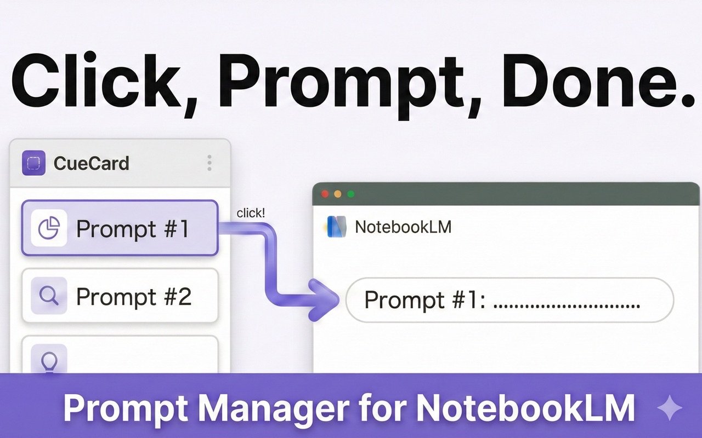
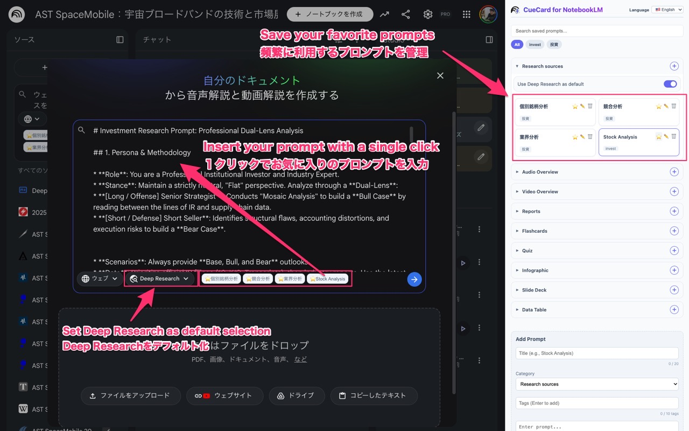

# Prompt Manager for NotebookLM

<p align="center">
  
</p>

<p align="center">
  <a href="https://chromewebstore.google.com/detail/ggfipajknejdemmbagcpgofmbniidkem">
    
  </a>
  <a href="https://github.com/jacky-fuji/prompt-manager-notebooklm/releases">
    
  </a>
  <a href="LICENSE">
    
  </a>
  <a href="https://buymeacoffee.com/jackyfuji">
    
  </a>
</p>

---

**Prompt Manager for NotebookLM** is a Chrome extension that lets you save, organize, and instantly inject reusable prompts into [Google NotebookLM](https://notebooklm.google.com) with a single click — no more copying and pasting the same prompts over and over again.

---

## ✨ Features

- **One-click prompt injection** — Click any saved prompt to instantly insert it into the active NotebookLM input field.
- **Category-based organization** — Organize prompts into categories such as Research, Chat, Audio Overview, Video Overview, Reports, Quiz, and more.
- **Subcategory support** — Fine-grained subcategory tagging (e.g., Chat → Conversation Style) for precise prompt management.
- **Favorites** — Star your most-used prompts for quick access via contextual buttons embedded directly within the NotebookLM UI.
- **Tag system** — Add custom tags to each prompt and filter your library instantly.
- **Full-text search** — Quickly find any prompt by title, content, or tag.
- **Multilingual UI** — Supports 14 languages: English 🇺🇸, Japanese 🇯🇵, Spanish 🇪🇸, French 🇫🇷, German 🇩🇪, Portuguese 🇧🇷, Italian 🇮🇹, Russian 🇷🇺, Chinese 🇨🇳 (Simplified & Traditional 🇹🇼), Korean 🇰🇷, Vietnamese 🇻🇳, Indonesian 🇮🇩, and Hindi 🇮🇳. Automatic language detection.
- **Auto-setting recall** — Remembers your preferred NotebookLM settings (e.g., output format, Deep Research toggle) and re-applies them automatically.
- **Up to 10,000 characters** — Supports long-form prompts for detailed instructions.

---

## 📸 Screenshot

<p align="center">
  
</p>

---

## 🚀 Installation

### From the Chrome Web Store (Recommended)

1. Visit the [Chrome Web Store page](https://chromewebstore.google.com/detail/ggfipajknejdemmbagcpgofmbniidkem).
2. Click **Add to Chrome**.
3. Open [NotebookLM](https://notebooklm.google.com) in your browser.
4. Click the extension icon in the toolbar to open the side panel.

### Manual Installation (for Developers)

1. Clone this repository:

   ```bash
   git clone https://github.com/jacky-fuji/prompt-manager-notebooklm.git
   ```

2. Open Chrome and navigate to `chrome://extensions/`.
3. Enable **Developer mode** (toggle in the top-right corner).
4. Click **Load unpacked** and select the cloned repository folder.
5. Open [NotebookLM](https://notebooklm.google.com) and click the extension icon.

---

## 🛠️ Usage

1. **Add a prompt** — Fill in the title, select a category, add optional tags, and write your prompt content in the side panel form. Click **Save**.
2. **Insert a prompt** — First click on the input field you want to target in NotebookLM, then click any saved prompt card.
3. **Use favorite buttons** — Star a prompt to make it appear as a quick-access button directly inside the NotebookLM UI (e.g., above the chat bar, inside the Customize Chat dialog).
4. **Filter and search** — Use the search box or click a tag chip to narrow down your prompt library.

---

## 🗂️ Supported Categories

Research Sources · Chat (+ Conversation Style) · Audio Overview · Video Overview · Reports · Flashcards · Quiz · Infographic · Slide Deck · Data Table

For the full category specification and auto-setting details, see [SPEC.md](SPEC.md).

---

## 🧰 Tech Stack

Manifest V3 Chrome Extension — Vanilla JavaScript, HTML, CSS (no frameworks) — Chrome Storage API & Side Panel API.

For architecture details, see [ARCHITECTURE.md](ARCHITECTURE.md).

---

## 🤝 Contributing

Contributions are welcome! If you have ideas, bug reports, or would like to improve the extension, please feel free to:

1. **Fork** this repository.
2. Create a new branch: `git checkout -b feat/your-feature-name`
3. Make your changes and commit: `git commit -m 'feat: describe your change'`
4. Push to your fork: `git push origin feat/your-feature-name`
5. Open a **Pull Request** against the `dev` branch.

Please open an [Issue](https://github.com/jacky-fuji/prompt-manager-notebooklm/issues) first if you'd like to propose a significant change.

---

## 📝 License

This project is licensed under the [MIT License](LICENSE).

---

## 🔒 Privacy Policy

Your privacy is important to us. All prompt data and settings are stored locally on your device using `chrome.storage.local`. No data is collected or transmitted to external servers.

For full details, please see our [Privacy Policy (PRIVACY.md)](PRIVACY.md).

---

## 📚 Documentation

| Document | Description |
|---|---|
| [SPEC.md](SPEC.md) | Functional specification (features, data model, categories, i18n) |
| [ARCHITECTURE.md](ARCHITECTURE.md) | Architecture and design (file map, data flow, components) |
| [PRIVACY.md](PRIVACY.md) | Privacy policy |
| [LICENSE](LICENSE) | MIT License |

---

## 👤 Author

**jacky-fuji**

- GitHub: [@jacky-fuji](https://github.com/jacky-fuji)
- Extension: [Prompt Manager for NotebookLM](https://chromewebstore.google.com/detail/ggfipajknejdemmbagcpgofmbniidkem)

---

## 🌟 Acknowledgements

Built to supercharge the [Google NotebookLM](https://notebooklm.google.com) experience and reduce repetitive prompt entry for power users.

If you find this useful, please consider leaving a ⭐ rating on the [Chrome Web Store](https://chromewebstore.google.com/detail/ggfipajknejdemmbagcpgofmbniidkem)!
